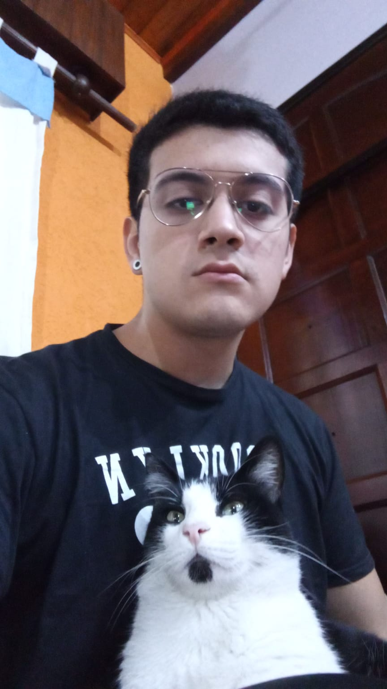

# Uriel Francisco Bravo
### Presentacion Personal

Hola me llamo Uriel, este es mi tercer cuatrimestre en la tecnicatura universitaria en programacion que brinda la Universidad Nacional de Hurlingham, del primer año solo me faltaria aprobar **matematica para informatica II**.
Nunca me gusto ir al colegio cuando era mas chico, los ultimos dos años de secundario me lleve todas las materias y todas las rendi en la primera instancia de examen en diciembre :zany_face:.

Apenas termine el secundario me anote en la licenciatura en filosofia en la universidad de buenos aires, termine el CBC y cuando entre en la carrera me di cuenta que no era lo que queria asi que no fui mas.

Desde los 17 años trabajo en un kiosco en el anden de una estacion de tren. El hecho de trabajar en un negocio autonomo me da la oportunidad de estudiar mientras trabajo y cuando necesito un dia libre para poder estudiar puedo darme el lujo de darme los dias de estudio sin tener que andar dandole explicaciones a nadie.

Cuando era chico me la pasaba jugando MMORPG, recuerdo entrar en los archivos del juego para modificar algunos atributos y tener ventajas sobre los demas en el juego ya que estaba modificando el tiempo de ejecucion de habilidades y eso me permitia ganar todos los enfrentamientos.

Siempre me gustaron muchos los videojuegos, cuando era chico me la pasaba 30 horas seguidas jugando League of legends.

Me considero un apasionado por el aprendizaje de cualquier tipo de conocimiento, por eso me gusta el area de programacion y mientras mas voy avanzando por la tecnicatura me voy dando cuenta que realmente me gusta mucho la informatica.

## Mis gustos

- Me gusta mucho la musica, tengo conocimientos de creacion de instrumentales a traves del software **Fruity Loops Studio**(fl studio), puedo samplear cualquier cosa literalmente.
- Se tocar la guitarra, el piano y el ukelele.
- Me gusta mucho el cannabis, me gustaria algun dia poder dedicarme desde el area programacion a la creacion de geneticas nuevas de cannabis o participar en algun proyecto relacionado al tema.
- Desde los 11 años hasta los 21 años practique boxeo, tengo mas de 50 exhibiciones de box en diferentes clubes de Buenos aires, llegue a adquirir una licencia amateur de boxeo.

Les dejo una imagen con mi gatito **EL COLITA** :sunglasses:

